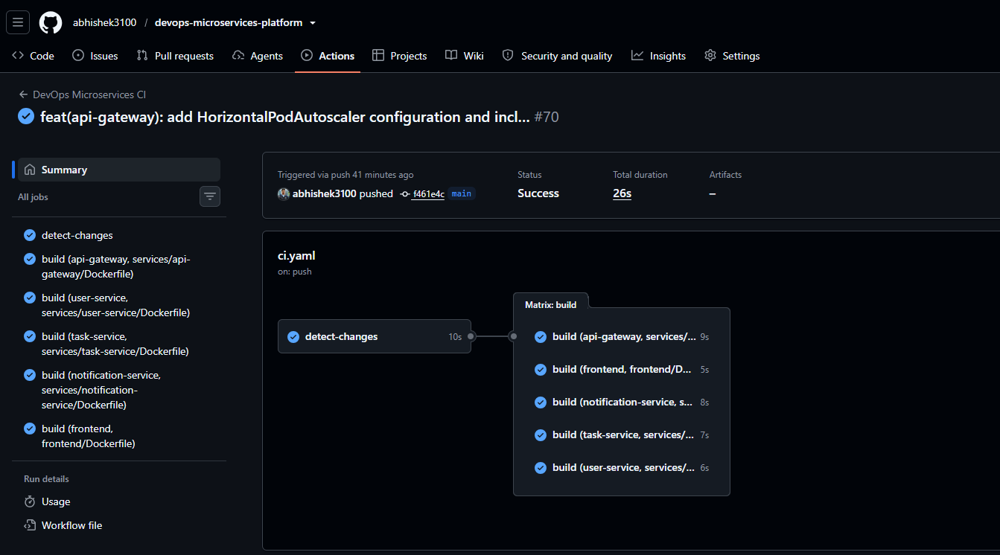
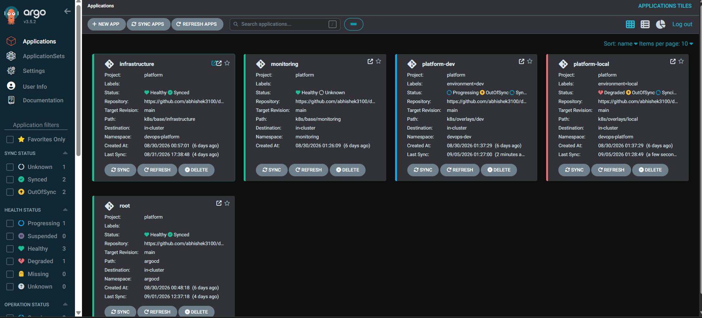
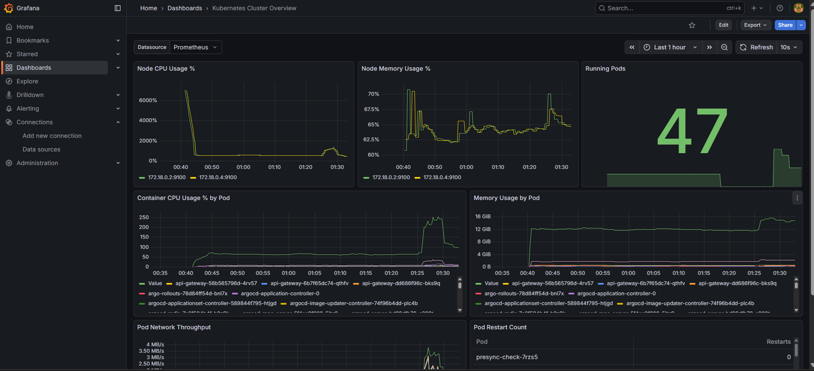
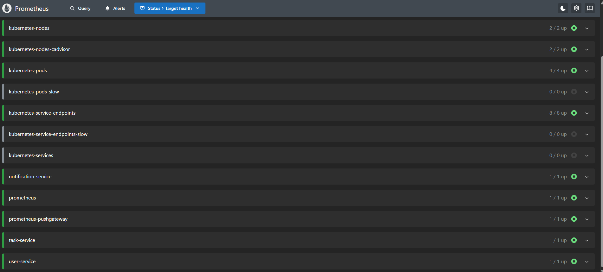
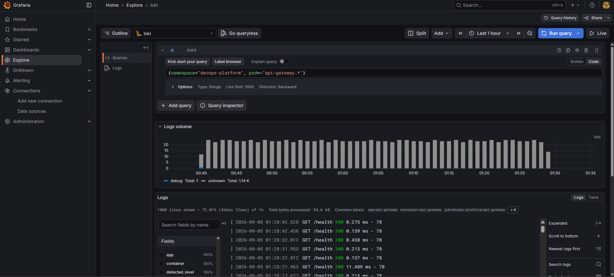
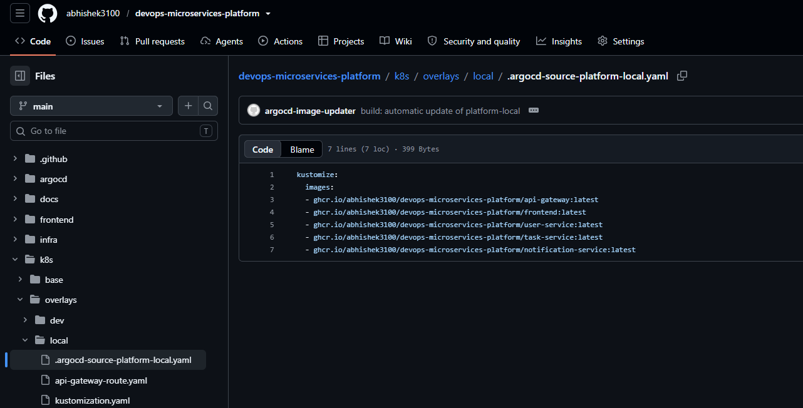

# DevOps Microservices Platform


A production-inspired DevOps platform demonstrating modern software delivery using microservices, Kubernetes, GitOps, CI/CD, Infrastructure as Code, and observability.

---

# 🎯 Purpose

This project was built as a hands-on learning and experimentation platform to implement production-inspired DevOps practices in a realistic microservices environment.

The objective was not only to build a working application but also to design, deploy, automate, monitor, and operate it using modern cloud-native tooling.

Throughout the project, features were implemented incrementally while solving real operational challenges such as deployment ordering, GitOps workflows, image automation, RBAC, Kubernetes resource management, observability, and multi-environment deployments.

> **This project serves as both a learning platform and a portfolio demonstrating practical DevOps and Platform Engineering concepts.**

---

# ⭐ Highlights

- Microservices Architecture
- REST + gRPC Communication
- Docker Multi-stage Builds
- GitHub Actions CI/CD
- GitHub Container Registry (GHCR)
- Kubernetes + Kustomize
- GitOps using Argo CD
- Argo CD ApplicationSets
- Progressive Syncs
- Sync Waves
- PreSync & PostSync Hooks
- Argo CD Image Updater
- Gateway API + Envoy Gateway
- Horizontal Pod Autoscaler (HPA)
- Prometheus Monitoring
- Grafana Dashboards
- Loki Centralized Logging
- Multi-environment Deployments
- Infrastructure as Code using Terraform

---

# 🚀 Project Overview

This repository implements a complete DevOps platform consisting of:

- React + Vite frontend
- Node.js API Gateway
- User Service (REST)
- Task Service (gRPC)
- Notification Service (gRPC)
- Shared Protocol Buffer contracts
- Dockerized services
- Kubernetes deployments
- GitOps with Argo CD
- Automated image updates
- Observability stack
- Infrastructure as Code

The platform demonstrates how modern DevOps practices integrate software development with automated deployment and infrastructure management.

---

# 🚀 CI/CD & GitOps Pipeline

```text
Developer
     │
     ▼
GitHub Repository
     │
     ▼
GitHub Actions
     │
     ▼
Build Docker Images
     │
     ▼
Push Images to GHCR
     │
     ▼
Argo CD Image Updater
     │
     ▼
Updates Git Repository
     │
     ▼
Argo CD
     │
     ▼
Kubernetes Cluster
     │
     ▼
Gateway API
     │
     ▼
Microservices
```

---

# 🏗️ Architecture

```text
                  Client / Browser
                         │
                         ▼
                Frontend (React + Vite)
                         │
                         ▼
                 API Gateway (Node.js)
                    │             │
                    │             ▼
                    │      User Service (REST)
                    │
                    ▼
              Task Service (gRPC)
                    │
                    ▼
         Notification Service (gRPC)
```

---

# 🔄 Service Communication

| Source | Destination | Protocol |
|----------|------------|----------|
| Browser | API Gateway | HTTP |
| API Gateway | User Service | REST |
| API Gateway | Task Service | gRPC |
| Task Service | Notification Service | gRPC |

Shared contracts are maintained under the `proto/` directory.

---

# 📸 Screenshots


## GitHub Actions Pipeline



---

## Argo CD Applications



---

## Grafana Dashboard



---

## Prometheus Targets



---

## Loki Logs



---

## Automated Image Updater

Argo CD Image Updater automatically commits updated image tags back to Git.


---

# 🧩 Repository Structure

```text
devops-microservices-platform/

├── .github/workflows/
├── argocd/
├── docs/
├── frontend/
├── infra/
├── k8s/
├── proto/
├── services/
│   ├── api-gateway/
│   ├── user-service/
│   ├── task-service/
│   └── notification-service/
├── terraform/
├── tests/
├── Makefile
├── README.md
└── ...
```

---

# 🛠️ Tech Stack

| Area | Technology |
|------|------------|
| Frontend | React, Vite |
| Backend | Node.js, Express |
| Microservices | Python |
| Communication | REST, gRPC |
| Contracts | Protocol Buffers |
| Containers | Docker |
| Orchestration | Kubernetes |
| Configuration | Kustomize |
| GitOps | Argo CD |
| API Gateway | Envoy Gateway |
| Monitoring | Prometheus |
| Dashboards | Grafana |
| Logging | Loki |
| Infrastructure | Terraform |
| CI/CD | GitHub Actions |
| Registry | GitHub Container Registry |

---

# 🚀 Production Features Implemented

### CI/CD

- GitHub Actions pipelines
- Automated Docker image builds
- GHCR image publishing
- SHA-based image versioning
- Latest image tagging

### Kubernetes

- Multi-service deployment
- Namespaces
- ConfigMaps
- Secrets
- Services
- Gateway API
- Envoy Gateway
- Resource Requests & Limits
- Health Probes
- Readiness Probes
- Liveness Probes
- Horizontal Pod Autoscaler (HPA)

### GitOps

- Argo CD
- App of Apps Pattern
- ApplicationSets
- Progressive Syncs
- Sync Waves
- PreSync Hooks
- PostSync Hooks
- Automated Image Updates
- Git Write-back

### Observability

- Prometheus
- Grafana
- Loki
- Promtail
- Metrics Collection
- Log Aggregation

### Infrastructure

- Terraform modules
- Docker Compose
- Kustomize Base/Overlay structure

---

# 🔐 Current Features

- JWT Authentication
- REST APIs
- gRPC Service Communication
- Health Checks
- GitOps Deployment
- Multi-environment Deployments
- Automated Image Updates
- Monitoring Dashboards
- Centralized Logging

---

# 🔄 Example Flow

## Create Task

1. User logs in
2. JWT token generated
3. Request reaches API Gateway
4. Gateway validates token
5. Task Service creates task via gRPC
6. Notification Service receives gRPC request
7. Notification processed

---

# 📡 API Endpoints

## User Service

```
POST /api/users/register
POST /api/users/login
GET  /api/users/profile
```

## Task Service

```
POST /api/tasks
GET  /api/tasks
GET  /health
```

---

# 🧪 Run Locally

## Docker Compose

```bash
make up
```

Frontend

```
http://localhost:8080
```

Gateway

```
http://localhost:3000
```

---

## Kubernetes

```bash
kubectl apply -k k8s/overlays/local
```

---

# 💡 Design Decisions

- REST is used for external APIs.
- gRPC is used for internal service communication.
- Shared `.proto` files provide contract-first development.
- GitOps ensures deployments remain declarative.
- Kustomize separates reusable base resources from environment-specific overlays.
- Argo CD automates reconciliation between Git and the cluster.
- Image Updater automatically promotes container image versions via Git commits.

---

# 📚 Key Learnings

This project provided practical experience with:

- Kubernetes architecture
- GitOps workflows
- Argo CD
- ApplicationSets
- Progressive Syncs
- Sync Waves
- Argo CD Hooks
- Image Automation
- Multi-environment deployments
- Gateway API
- Envoy Gateway
- Observability
- Docker image lifecycle
- Kubernetes RBAC
- Horizontal Pod Autoscaling
- CI/CD design
- Infrastructure as Code

---

# 💡 Challenges Solved

Some implementation challenges addressed during development:

- Designing GitOps repository structure
- Managing deployment ordering with Sync Waves
- Implementing ApplicationSets
- Configuring Hook RBAC
- Automating image updates through Git commits
- Separating infrastructure and application resources
- Building reusable Kustomize overlays
- Managing multi-environment deployments
- Troubleshooting Kubernetes reconciliation issues

---

# 🚦 Project Status

## ✅ Completed

This project is feature complete and serves as a production-inspired DevOps portfolio project.

### Future Enhancements

- Cilium Networking
- Network Policies
- External Secrets Operator
- Kyverno Policies
- Argo Rollouts
- Service Mesh (Istio)

---

# 👨‍💻 Author

**Abhishek Kumar**

DevOps | Cloud | Kubernetes | Platform Engineering

GitHub: https://github.com/abhishek3100

LinkedIn: https://linkedin.com/in/abhishekbgs